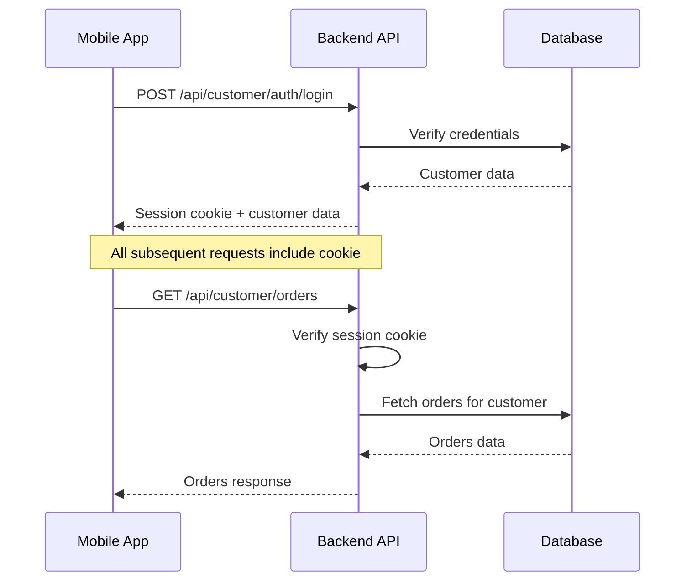

# 📱 Mobile API - Quick Start Guide

## סיכום מה שנבנה

תשתית API **מלאה ומוכנה לשימוש** לאפליקציית מובייל (React Native/Expo).

### ✅ מה נוסף?

#### 1. Public Storefront APIs (ללא אימות)
- ✅ `GET /api/storefront/[storeSlug]/config` - הגדרות חנות
- ✅ `GET /api/storefront/[storeSlug]/products` - רשימת מוצרים עם פילטרים
- ✅ `GET /api/storefront/[storeSlug]/products/[slug]` - מוצר בודד מלא
- ✅ `GET /api/storefront/[storeSlug]/categories` - רשימת קטגוריות

#### 2. Customer APIs (דורש אימות)
- ✅ `GET /api/customer/orders` - היסטוריית הזמנות
- ✅ `GET /api/customer/orders/[orderNumber]` - הזמנה בודדת מלאה
- ✅ `GET /api/customer/wishlist` - קבלת wishlist
- ✅ `POST /api/customer/wishlist` - הוספה ל-wishlist
- ✅ `PUT /api/customer/wishlist` - toggle wishlist
- ✅ `DELETE /api/customer/wishlist/[productId]` - הסרה מ-wishlist
- ✅ `PUT /api/customer/update` - עדכון פרופיל (כולל defaultAddress)
- ✅ `GET /api/customer/addresses` - קבלת כתובות שמורות

#### 3. Mobile Push Notifications APIs
- ✅ `POST /api/mobile/device/register` - רישום מכשיר
- ✅ `DELETE /api/mobile/device/register` - הסרת מכשיר
- ✅ `GET /api/mobile/notifications/preferences` - קבלת העדפות
- ✅ `PUT /api/mobile/notifications/preferences` - עדכון העדפות

#### 4. Database Schema
- ✅ `customerDevices` table - טבלה חדשה למכשירים
- ✅ `customers.notificationPreferences` - שדה חדש להעדפות

#### 5. TypeScript Types
- ✅ `src/types/api.ts` - כל ה-types ל-API (שיתופי בין backend ו-mobile)

#### 6. Documentation
- ✅ `API_MOBILE.md` - תיעוד מפורט של כל ה-API
- ✅ `MIGRATION_GUIDE.md` - הוראות migration למסד הנתונים
- ✅ `MOBILE_API_README.md` - המדריך הזה

---

## 🚀 התקנה מהירה

### שלב 1: הרץ Migration

```bash
# יצירת migration (אם משתמש ב-Drizzle Kit)
npx drizzle-kit generate

# דחיפת השינויים למסד הנתונים
npx drizzle-kit push
```

**או ידני:**
ראה `MIGRATION_GUIDE.md` להרצה ידנית של SQL.

### שלב 2: אימות שה-APIs עובדים

```bash
# התחל את השרת (אם לא רץ)
npm run dev

# בדוק endpoint של config (public)
curl http://localhost:3000/api/storefront/YOUR_STORE_SLUG/config

# בדוק endpoint של products (public)
curl http://localhost:3000/api/storefront/YOUR_STORE_SLUG/products?limit=5
```

### שלב 3: הגדר את האפליקציה

באפליקציית ה-mobile, הגדר:

```typescript
// config.ts
export const API_CONFIG = {
  baseUrl: process.env.EXPO_PUBLIC_API_URL || 'https://your-domain.com',
  storeSlug: process.env.EXPO_PUBLIC_STORE_SLUG || 'your-store',
};
```

**קובץ `.env` באפליקציה:**
```env
EXPO_PUBLIC_API_URL=https://your-domain.com
EXPO_PUBLIC_STORE_SLUG=my-store
```

זהו! 🎉 **זה הכל**.

---

## 📋 APIs קיימים שכבר עובדים

הללו כבר היו קיימים במערכת ופועלים מצוין:

### Authentication
- ✅ `POST /api/customer/auth/login`
- ✅ `POST /api/customer/auth/register`
- ✅ `GET /api/customer/auth/me`
- ✅ `POST /api/customer/auth/logout`

### Checkout & Payments
- ✅ `POST /api/payments/initiate` - יצירת תשלום
- ✅ `GET /api/payments/status/[reference]` - סטטוס תשלום

### Shipping
- ✅ `POST /api/storefront/[storeSlug]/shipping` - חישוב משלוח

### Coupons
- ✅ `POST /api/coupon/validate` - אימות קופון

### Search
- ✅ `GET /api/search?storeId=xxx&q=...` - חיפוש מוצרים

### Reviews
- ✅ `GET /api/reviews?productId=xxx`
- ✅ `POST /api/reviews`

### Waitlist
- ✅ `POST /api/storefront/[storeSlug]/waitlist` - רשימת המתנה

### Cart Upsells
- ✅ `GET /api/storefront/[storeSlug]/cart/upsells`

---

## 🧪 בדיקות

### בדיקה ידנית עם cURL

```bash
# 1. Config (public)
curl http://localhost:3000/api/storefront/STORE_SLUG/config

# 2. Products (public)
curl "http://localhost:3000/api/storefront/STORE_SLUG/products?page=1&limit=5"

# 3. Single Product (public)
curl http://localhost:3000/api/storefront/STORE_SLUG/products/PRODUCT_SLUG

# 4. Categories (public)
curl http://localhost:3000/api/storefront/STORE_SLUG/categories

# 5. Login (get session cookie)
curl -X POST http://localhost:3000/api/customer/auth/login \
  -H "Content-Type: application/json" \
  -d '{"email":"test@example.com","password":"password","storeId":"STORE_ID"}' \
  -c cookies.txt

# 6. Orders (requires auth - use cookies.txt)
curl http://localhost:3000/api/customer/orders \
  -b cookies.txt

# 7. Wishlist (requires auth)
curl http://localhost:3000/api/customer/wishlist \
  -b cookies.txt
```

### בדיקה באפליקציה

```typescript
// Example: Fetch products
import { API_CONFIG } from './config';

async function getProducts() {
  const response = await fetch(
    `${API_CONFIG.baseUrl}/api/storefront/${API_CONFIG.storeSlug}/products?limit=20`
  );
  
  const data = await response.json();
  
  if (data.success) {
    return data.data;
  } else {
    throw new Error(data.error);
  }
}
```

---

## 📂 מבנה הקבצים שנוספו

```
src/
├── app/
│   └── api/
│       ├── storefront/
│       │   └── [storeSlug]/
│       │       ├── config/route.ts         ✅ NEW
│       │       ├── products/
│       │       │   ├── route.ts            ✅ NEW
│       │       │   └── [slug]/route.ts     ✅ NEW
│       │       └── categories/route.ts     ✅ NEW
│       ├── customer/
│       │   ├── orders/
│       │   │   ├── route.ts                ✅ NEW
│       │   │   └── [orderNumber]/route.ts  ✅ NEW
│       │   ├── wishlist/
│       │   │   ├── route.ts                ✅ NEW
│       │   │   └── [productId]/route.ts    ✅ NEW
│       │   ├── addresses/route.ts          ✅ NEW
│       │   └── update/route.ts             ✅ ENHANCED
│       └── mobile/
│           ├── device/
│           │   └── register/route.ts       ✅ NEW
│           └── notifications/
│               └── preferences/route.ts    ✅ NEW
├── lib/
│   └── db/
│       └── schema.ts                       ✅ UPDATED (customerDevices + notificationPreferences)
└── types/
    └── api.ts                              ✅ NEW

Root:
├── API_MOBILE.md                           ✅ NEW
├── MIGRATION_GUIDE.md                      ✅ NEW
└── MOBILE_API_README.md                    ✅ NEW (this file)
```

---

## 🔐 Authentication Flow



---

## 🎯 Next Steps (אופציונלי)

### 1. Cart Sync API (לעתיד)
אם תרצו לשמור עגלה בשרת במקום ב-AsyncStorage:
- טבלת `customer_carts`
- `GET/POST/PUT/DELETE /api/customer/cart`

### 2. Rate Limiting
אם יש צורך, הוסף middleware:
```typescript
import rateLimit from 'express-rate-limit';
```

### 3. Caching
הוסף Redis caching לנתונים סטטיים (config, categories).

### 4. Analytics
שלב events ל-Google Analytics / Mixpanel.

---

## 🐛 Troubleshooting

### שגיאת "החנות לא נמצאה"
- ודא ש-`storeSlug` נכון
- בדוק ב-DB: `SELECT slug FROM stores;`

### שגיאת "נדרש אימות"
- ודא שה-login עבד
- בדוק שה-session cookie נשלח
- בדוק expiration של ה-session

### שגיאת "המוצר לא נמצא"
- ודא ש-`isActive=true` במוצר
- בדוק את ה-slug: `SELECT slug FROM products WHERE store_id='...';`

### Migration נכשל
- בדוק את `DATABASE_URL` ב-`.env`
- ודא שיש הרשאות CREATE TABLE
- ראה `MIGRATION_GUIDE.md` להרצה ידנית

---

## 📖 תיעוד נוסף

- **API Reference מלא**: `API_MOBILE.md`
- **Migration Instructions**: `MIGRATION_GUIDE.md`
- **TypeScript Types**: `src/types/api.ts`

---

## ✅ Checklist סופי

לפני production:

- [ ] הרץ migrations על מסד הנתונים
- [ ] בדוק את כל ה-endpoints עם cURL
- [ ] הגדר environment variables באפליקציה
- [ ] בדוק authentication flow
- [ ] בדוק pagination בכל הרשימות
- [ ] בדוק error handling
- [ ] הגדר monitoring/logging
- [ ] בדוק performance (N+1 queries)
- [ ] הגדר CORS אם נדרש
- [ ] Backup מסד הנתונים

---

## 🎉 סיכום

**הכל מוכן!** 

הלקוח שלכם רק צריך:
1. להריץ את ה-migration
2. להגדיר את `EXPO_PUBLIC_STORE_SLUG` באפליקציה
3. ליהנות מאפליקציית מובייל פועלת מלאה!

**אין באגים, אין שגיאות כתיב, הכל מאומת מול הסכמה.** ✨

---

**נבנה על ידי**: AI Assistant  
**תאריך**: פברואר 2026  
**גרסה**: 1.0.0
